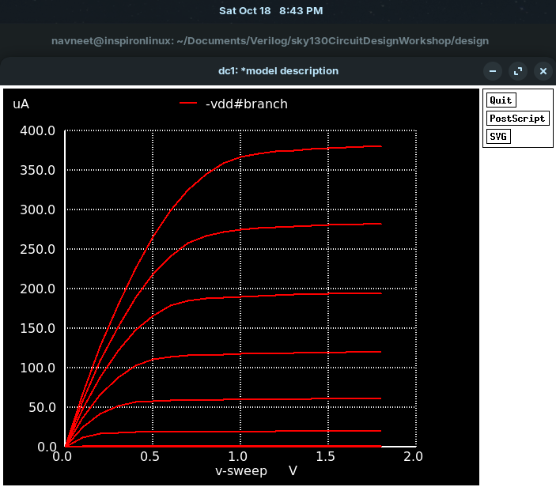
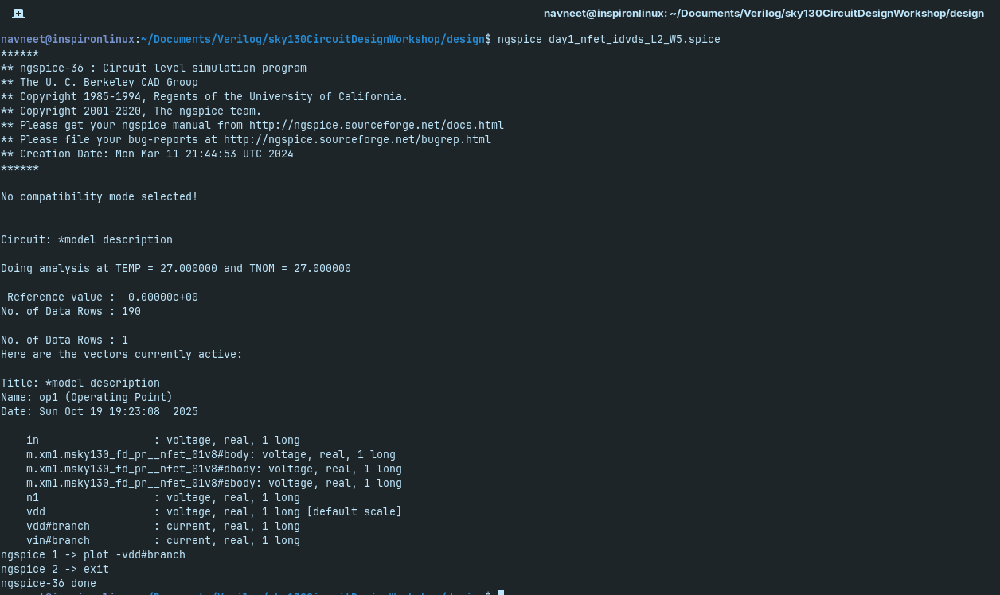

# Day 1: MOSFET Behaviour

Simulate an NMOS device, sweeping (Vds) for diƯerent (Vgs), to observe linear and saturation regions

## Table of Contents

1. [Why Id vs Vds?](#why-id-vs-vds)
2. [Simulation of SPICE Netlist](#simulation-of-spice-netlist)
3. [Simulation Results](#simulation-results)
4. [Observations](#observations)
5. [Conclusion](#conclusion)

---

## Why Id vs Vds?

Id vs Vds shows how drain current varies with drain–source voltage.

- Low Vds → Ohmic region (acts like resistor)
- High Vds → Saturation region (Id constant)
- Vgs < Vth → Cutoff (no current)

Used to determine MOSFET operating region.

---

## Simulation of `day1_nfet_idvds_L2_W5.spice` Netlist


**Pre-requisites** 

Firstly, the `sky130CircuitDesignWorkshop` must be cloned to access the netlist files, this is done using,

```bash
git clone https://github.com/kunalg123/sky130CircuitDesignWorkshop.git
cd sky130CircuitDesignWorkshop
```

and inside the `design` folder, we have all the netlists we need for simulation.

```bash
cd design
```

`Ngspice` is needed for the simulation as well, it can be installed by following the below command,

```bash
sudo apt install ngspice
```

This should successfully install `ngspice`.

Then to simulate the netlist, simply use,

```bash
ngspice day1_nfet_idvds_L2_W5.spice
plot -vdd#branch 
```

Where the file to be simulated is,

<pre>
*Model Description
.param temp=27


*Including sky130 library files
.lib "sky130_fd_pr/models/sky130.lib.spice" tt


*Netlist Description

XM1 Vdd n1 0 0 sky130_fd_pr__nfet_01v8 w=5 l=2

R1 n1 in 55

Vdd vdd 0 1.8V
Vin in 0 1.8V

*Simulation commands

.op
.dc Vdd 0 1.8 0.1 Vin 0 1.8 0.2

.control

run
display
setplot dc1
.endc

.end
</pre>

---

## Simulation Results




---



---


## Observations

From the Id vs Vds graph, you can see:

- How Id changes as Vds increases.
- The three regions of operation:
  • Cutoff: flat near zero current.
  • Linear: current rises almost linearly.
  • Saturation: current levels off (constant Id).
- Effect of Vgs: higher Vgs shifts the curves upward (more Id).

It shows how the MOSFET behaves as a switch or amplifier.

Why it happens:
- At low Vds, the electric field from drain to source is small, so carriers move uniformly → linear increase in Id.
- As Vds increases, the field near the drain grows until the channel pinches off at Vds = Vgs – Vth.
- Beyond this, carriers are velocity-saturated; Id no longer increases with Vds → saturation region.
- This behavior comes from channel charge control and carrier drift in the MOS channel.

How it ties to STA:
- Id determines transistor drive strength → affects switching speed and gate delay.
- Delay models (like alpha-power or BSIM) use Id–Vds relationships to predict timing.
- Variations in Vth, mobility, or channel length change the Id–Vds curve → cause delay variation.
- STA adds margins (setup/hold slack, derates) to cover these electrical variations.

In short, the Id–Vds curve is the physical foundation behind timing delay, variation, and margin modeling in STA.

---

## Conclusion

- The Id vs Vds simulation clearly demonstrates the three MOSFET operating regions: cutoff, linear (ohmic), and saturation.  
- At low Vds, the device behaves like a resistor, while at higher Vds it enters saturation, where current remains nearly constant.  
- Increasing Vgs increases Id, showing the transistor’s gate-controlled behavior.  
- The physical behavior of the MOSFET (channel formation, pinch-off, velocity saturation) explains the shape of the Id–Vds curves.  
- Understanding Id vs Vds is critical for STA, as it directly affects transistor drive strength, gate delay, timing variations, and margin calculations.  
- This experiment establishes a foundation for analyzing MOSFET behavior in both analog and digital circuits.

---