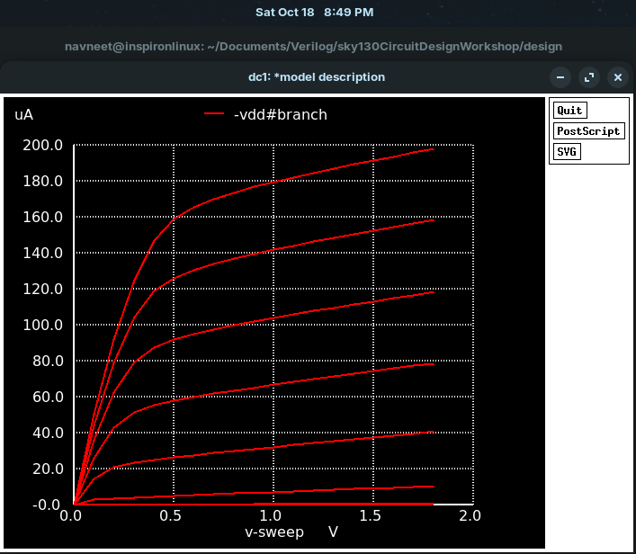
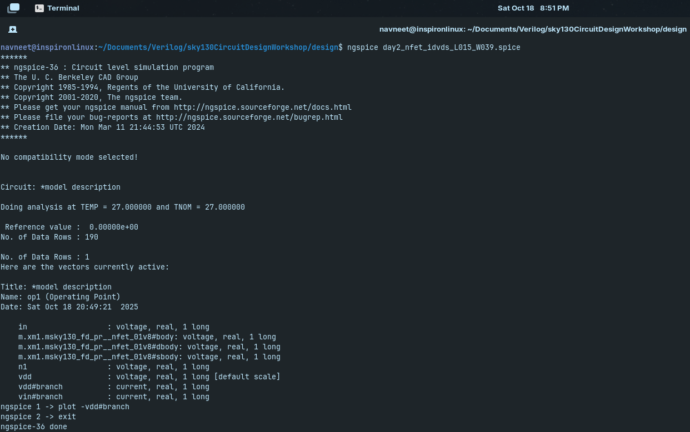
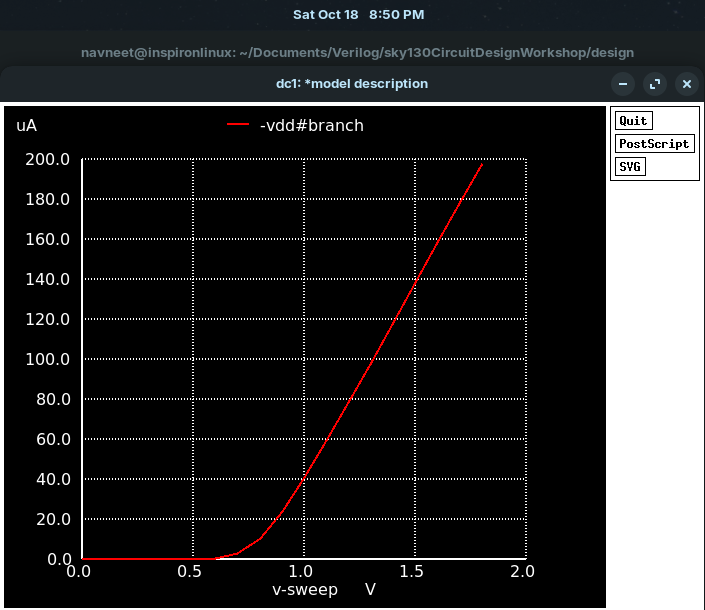
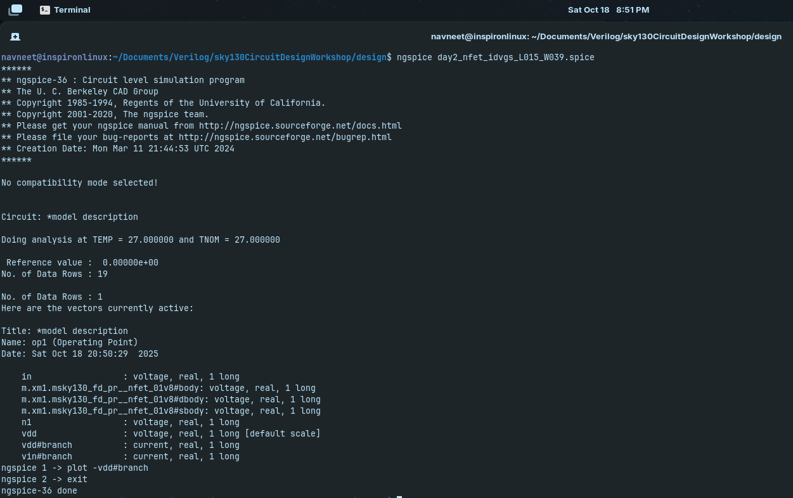

# Day 2: Threshold Voltage Extraction & Velocity Saturation

Sweep (Vgs) vs. ( Id ) and extract threshold ( Vt ) (e.g. by linear extrapolation), Observe eƯects of velocity saturation in short-channel regime.

## Table of Contents

1. [Why are they important?](#why-are-they-important)
2. [Simulation of day2_nfet_idvds_L015_W039.spice Netlist](#simulation-of-day2_nfet_idvds_l015_w039spice-netlist)
3. [Simulation Results](#simulation-results)
4. [Simulation of day2_nfet_idvgs_L015_W039.spice Netlist](#simulation-of-day2_nfet_idvgs_l015_w039spice-netlist)
5. [Simulation Results](#simulation-results-1)
6. [Observations](#observations)
7. [Conclusion](#conclusion)

---

## Why are they important?

1. Threshold Voltage (Vth) Extraction:
- Vth is the gate voltage where the MOSFET starts conducting.
- Determines switching behavior, drive current (Id), and propagation delay.
- Variations in Vth affect timing margins and noise tolerance.
- STA relevance: Accurate Vth is needed for delay modeling and timing analysis.

2. Velocity Saturation:
- At high electric fields, carrier velocity saturates, limiting Id.
- Changes Id–Vds slope, affecting current-drive and circuit speed.
- STA relevance: Delay models must account for velocity saturation in short-channel devices.

---

## Simulation of `day2_nfet_idvds_L015_W039.spice` Netlist

Simulate the netlist by,

```bash
ngspice day2_nfet_idvds_L015_W039.spice
plot -vdd#branch 
```

Where the file to be simulated is,

<pre>
*Model Description
.param temp=27


*Including sky130 library files
.lib "sky130_fd_pr/models/sky130.lib.spice" tt


*Netlist Description

XM1 Vdd n1 0 0 sky130_fd_pr__nfet_01v8 w=0.39 l=0.15

R1 n1 in 55

Vdd vdd 0 1.8V
Vin in 0 1.8V

*simulation commands

.op
.dc Vdd 0 1.8 0.1 Vin 0 1.8 0.2

.control

run
display
setplot dc1
.endc

.end
</pre>

---

## Simulation Results



---



---


## Simulation of `day2_nfet_idvgs_L015_W039.spice` Netlist

Simulate the netlist by,

```bash
ngspice day2_nfet_idvgs_L015_W039.spice
plot -vdd#branch 
```

Where the file to be simulated is,

<pre>
*Model Description
.param temp=27


*Including sky130 library files
.lib "sky130_fd_pr/models/sky130.lib.spice" tt


*Netlist Description

XM1 Vdd n1 0 0 sky130_fd_pr__nfet_01v8 w=0.39 l=0.15

R1 n1 in 55

Vdd vdd 0 1.8V
Vin in 0 1.8V

*simulation commands

.op
.dc Vin 0 1.8 0.1 

.control

run
display
setplot dc1
.endc

.end
</pre>

---

## Simulation Results



---



---

## Observations

1. Threshold Voltage (Vth) Extraction:

- Select linear portion of the saturation region (Id rises significantly):

   Vgs = 0.7 V to 1.2 V

- Take square root of Id for these points:

| Vgs (V) | Id (A)     | sqrt(Id) (A^0.5) |
| ------- | ---------- | ---------------- |
| 0.7     | 2.90077e-6 | 0.001703         |
| 0.8     | 1.04328e-5 | 0.003231         |
| 0.9     | 2.38056e-5 | 0.004878         |
| 1.0     | 4.07673e-5 | 0.006385         |
| 1.1     | 5.93694e-5 | 0.007705         |
| 1.2     | 7.87352e-5 | 0.008871         |


- Compute slope (k) using first and last points:

k = (0.008871 - 0.001703) / (1.2 - 0.7) ≈ 0.014336

- Extrapolate to sqrt(Id) = 0 to find Vth:

Vth = Vgs - sqrt(Id)/k

Using Vgs = 0.7 V: Vth ≈ 0.7 - 0.001703/0.014336 ≈ 0.582 V

Threshold Voltage: Vth ≈ 0.58 V


2. **Id vs Vgs Behavior:**
   - As Vgs increases from 0, Id remains near zero until Vgs ≈ Vth (cutoff region).
   - Beyond Vth, Id rises rapidly, showing the MOSFET turns on.
   - In long-channel devices, Id increases quadratically with (Vgs – Vth) in saturation.
   - In short-channel devices, Id rise is less steep due to velocity saturation.

3. **Velocity Saturation Effects:**
   - In short-channel MOSFETs, carrier velocity limits the drain current.
   - Saturation current is lower than expected from long-channel quadratic behavior.
   - Id vs Vgs curve appears “less steep” in the saturation region.
   - This affects drive strength, switching speed, and timing margins.

---

## Conclusion

- The Vgs sweep simulation allowed extraction of the MOSFET threshold voltage (Vth ≈ 0.58 V) using linear extrapolation of the sqrt(Id) vs Vgs curve.  
- Id vs Vgs behavior clearly shows the cutoff region, rapid turn-on beyond Vth, and saturation region.  
- In the short-channel device (L = 0.15 µm), velocity saturation limits carrier speed, causing the Id rise in saturation to be less steep than long-channel devices.  
- Velocity saturation reduces drive current, impacting switching speed, gate delay, and timing margins in digital circuits.  
- Understanding both Vth and velocity saturation is essential for accurate device modeling, timing analysis, and robust STA design.  

---