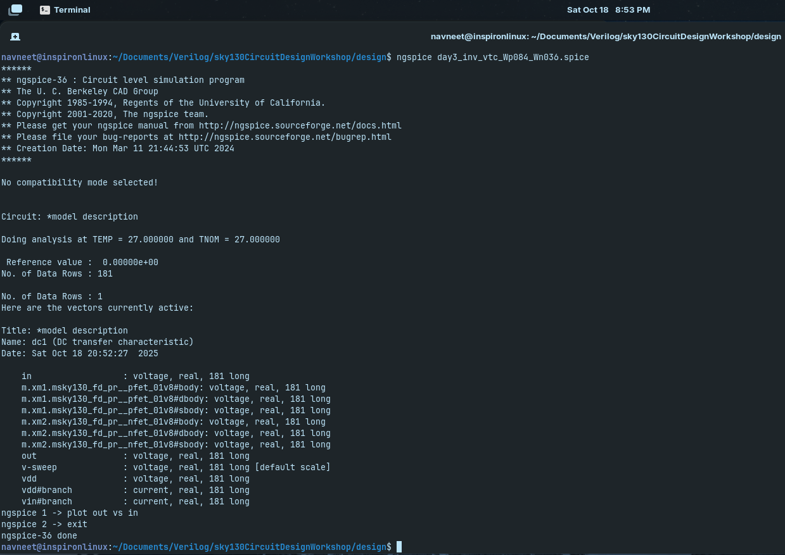

# Day 3: CMOS Inverter: Voltage Transfer Characteristic (VTC) & Transient Behavior

Build a CMOS inverter (PMOS + NMOS), Sweep input, plot ( V{out} ) vs. ( V{in} ), Identify the switching threshold ( Vm ) (point where ( V{in} = V{out} )).

Apply a pulse input to the inverter Extract rise and fall propagation delays (times at ( {Vdd}/2 ) crossing)

---

## Table of Contents

1. [Why VTC is Important](#why-is-vtc-important)
2. [CMOS Inverter Simulation: VTC](#simulation-of-day3_inv_vtc_wp084_wn036spice-netlist)
3. [Simulation Results](#simulation-results)
4. [CMOS Inverter Simulation: Transient Behavior](#simulation-of-day3_inv_tran_wp084_wn036spice-netlist)
5. [Simulation Results](#simulation-results-1)
6. [Observations](#observations)
7. [Conclusion](#conclusion)

---

## Why is VTC Important

- The Voltage Transfer Characteristic (VTC) shows how a digital gate or circuit output (Vout) responds to varying input voltage (Vin).  
- Key for understanding **switching behavior**: identifies when the output transitions from HIGH to LOW and vice versa.  
- Determines **noise margins**: regions where input variations do not change the logic state, ensuring reliable operation.  
- Helps identify the **switching threshold (Vm)**, critical for timing and logic compatibility in circuits.  
- Essential for **circuit design and verification**, as it links device-level behavior (Id–Vgs/Id–Vds) to gate-level performance.  

## Why is Transient Analysis Important

- Evaluates the **time-dependent behavior** of a circuit, including how outputs respond to changing inputs.  
- Determines **propagation delays, rise and fall times**, which are critical for timing analysis.  
- Detects **glitches, overshoots, and dynamic performance issues** that static analysis cannot reveal.  
- Helps assess **dynamic power consumption** and signal integrity under real operating conditions.  
- Essential for **design verification and optimization**, ensuring reliable and fast circuit operation.

---

## Simulation of `day3_inv_vtc_Wp084_Wn036.spice` Netlist

Simulate the netlist by,

```bash
ngspice day3_inv_vtc_Wp084_Wn036.spice
plot out vs in
```

Where the file to be simulated is,

<pre>
*Model Description
.param temp=27


*Including sky130 library files
.lib "sky130_fd_pr/models/sky130.lib.spice" tt


*Netlist Description


XM1 out in vdd vdd sky130_fd_pr__pfet_01v8 w=0.84 l=0.15
XM2 out in 0 0 sky130_fd_pr__nfet_01v8 w=0.36 l=0.15


Cload out 0 50fF

Vdd vdd 0 1.8V
Vin in 0 1.8V

*simulation commands

.op

.dc Vin 0 1.8 0.01

.control
run
setplot dc1
display
.endc

.end
</pre>

`XM1 out in vdd vdd sky130_fd_pr__pfet_01v8 w=0.84 l=0.15` is the PMOS and

`XM2 out in 0 0 sky130_fd_pr__nfet_01v8 w=0.36 l=0.15` is the NMOS here.

---

## Simulation Results


---



---

## Simulation of `day3_inv_tran_Wp084_Wn036.spice` Netlist

Simulate the netlist by,

```bash
ngspice day3_inv_tran_Wp084_Wn036.spice
plot out vs in
```

Where the file to be simulated is,

<pre>
*Model Description
.param temp=27


*Including sky130 library files
.lib "sky130_fd_pr/models/sky130.lib.spice" tt


*Netlist Description


XM1 out in vdd vdd sky130_fd_pr__pfet_01v8 w=0.84 l=0.15
XM2 out in 0 0 sky130_fd_pr__nfet_01v8 w=0.36 l=0.15


Cload out 0 50fF

Vdd vdd 0 1.8V
Vin in 0 PULSE(0V 1.8V 0 0.1ns 0.1ns 2ns 4ns)

*simulation commands

.tran 1n 10n

.control
run
.endc

.end
</pre>


---

## Simulation Results


---


---

## Observations

1. **Voltage Transfer Characteristic (VTC):**
   - The output voltage transitions from **V_OH ≈ 1.8 V** (logic HIGH) to **V_OL ≈ 0 V** (logic LOW) as the input goes from 0 to V_DD.  
   - The **switching threshold (V_M)**, where V_in = V_out, is roughly around **0.9 V** (50% of V_DD).  
   - The slope at the switching threshold is very steep, indicating **high gain**, which ensures fast switching.  
   - Noise margins can be inferred:
     - **NMH ≈ V_OH - V_M**
     - **NML ≈ V_M - V_OL**
   - Symmetric CMOS inverter design ensures NMH ≈ NML, providing robust noise immunity.

2. **Transient Response (Rise/Fall Behavior):**
   - When the input switches from LOW → HIGH:
     - The output transitions from HIGH → LOW with a **fall propagation delay (t_PHL)**.  
   - When the input switches from HIGH → LOW:
     - The output rises from LOW → HIGH with a **rise propagation delay (t_PLH)**.  
   - The rise/fall times are typically asymmetric due to differences in **PMOS vs NMOS drive strength**.  
   - Faster transitions are observed when the transistor driving the output has higher current capability.

3. **Effect of Load Capacitance:**
   - Larger capacitive loads at the output increase rise/fall times and propagation delays.  
   - Smaller loads allow sharper transitions and faster switching.

4. **Short-Channel Effects (if applicable):**
   - Velocity saturation in short-channel MOSFETs reduces the effective drive current.  
   - This slightly slows down the output transitions, flattening the VTC slope near the switching threshold.  

5. **Design Insights:**
   - VTC gives a direct view of inverter **logic behavior, gain, and noise margins**.  
   - Transient analysis helps estimate **propagation delays**, which are crucial for timing analysis and STA.  
   - Understanding VTC and transient response together allows designers to **optimize inverter performance** for speed, power, and reliability.

---

## Conclusion

- The CMOS inverter exhibits a clear and sharp **Voltage Transfer Characteristic (VTC)**, transitioning from V_OH ≈ 1.8 V to V_OL ≈ 0 V as Vin sweeps from 0 to V_DD.  
- The **switching threshold (V_M)** occurs around 0.9 V, approximately 50% of V_DD, providing balanced noise margins (NMH ≈ NML).  
- Transient simulations reveal **rise (t_PLH)** and **fall (t_PHL)** propagation delays, which are influenced by PMOS/NMOS sizing and load capacitance.  
- **Asymmetric rise/fall times** arise from differing drive strengths of PMOS and NMOS transistors.  
- **Short-channel effects**, such as velocity saturation, can slightly reduce drive current, flattening the VTC slope and affecting switching speed.  

---