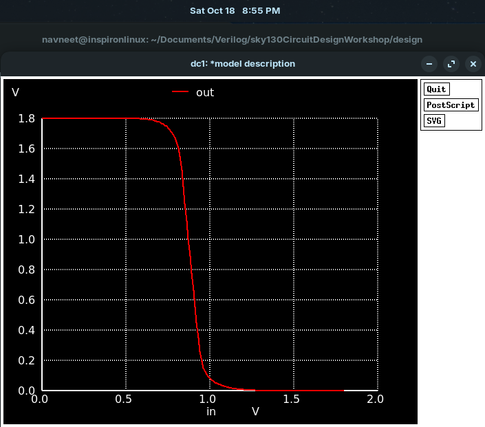
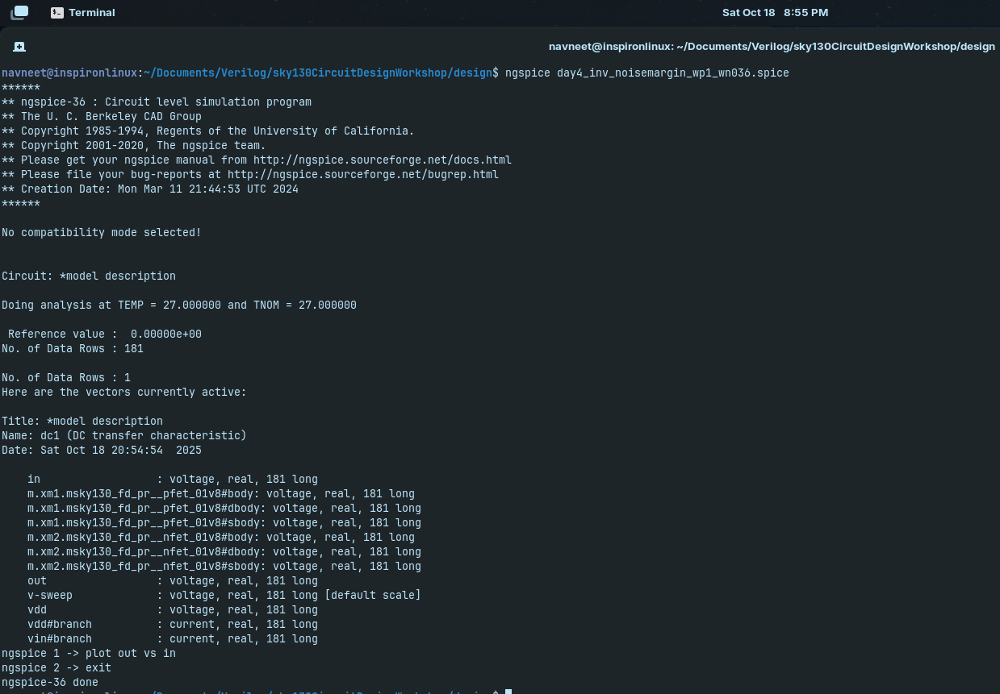
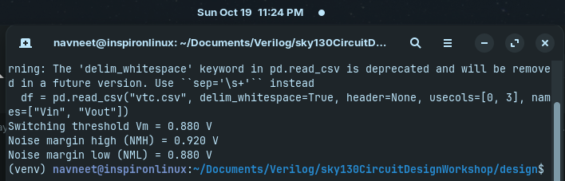

# Day 4: Noise Margin / Robustness Analysis

From the VTC plot, determine ( V{IL}, V{IH}, V{OL}, V{OH} ), Compute ( NML = V{IL} - V{OL} ) and ( NMH = V{OH} - V{IH} )

---

## Table of Contents

1. [Why Noise Margin / Robustness Analysis is Important](#why-noise-margin--robustness-analysis-is-important)
2. [Simulation of day4_inv_noisemargin_wp1_wn036.spice Netlist](#simulation-of-day4_inv_noisemargin_wp1_wn036spice-netlist)
3. [Simulation Results](#simulation-results)
4. [Observations](#observations)
5. [Conclusion](#conclusion)

---

## Why Noise Margin / Robustness Analysis is Important

- Ensures **reliable logic operation** by defining safe HIGH and LOW voltage levels.  
- Protects against **noise, process, voltage, and temperature variations**.  
- Maintains **signal integrity** in high-speed or dense circuits.  
- Supports **robust design**, allowing proper scaling and safe operation.  
- Complements **STA**, ensuring signals meet timing and logic correctness.

---

## Simulation of `day4_inv_noisemargin_wp1_wn036.spice` Netlist

Simulate the netlist by,

```bash
ngspice day4_inv_noisemargin_wp1_wn036.spice
plot out vs in
```

Where the file to be simulated is,

<pre>
*Model Description
.param temp=27


*Including sky130 library files
.lib "sky130_fd_pr/models/sky130.lib.spice" tt


*Netlist Description


XM1 out in vdd vdd sky130_fd_pr__pfet_01v8 w=1 l=0.15
XM2 out in 0 0 sky130_fd_pr__nfet_01v8 w=0.36 l=0.15


Cload out 0 50fF

Vdd vdd 0 1.8V
Vin in 0 1.8V

*simulation commands

.op

.dc Vin 0 1.8 0.01

.control
run
setplot dc1
display
.endc

.end
</pre>

---

## Simulation Results



---



---

## Observations 




The Noise Margins were calculated using the following python code

```python
import pandas as pd
import numpy as np

# Load CSV using whitespace separation
df = pd.read_csv("vtc.csv", delim_whitespace=True, header=None, usecols=[0, 3], names=["Vin", "Vout"])

# Calculate switching threshold Vm (Vin = Vout)
df["diff"] = np.abs(df["Vin"] - df["Vout"])
Vm_row = df.loc[df["diff"].idxmin()]
Vm = Vm_row["Vin"]

Vdd = df["Vout"].max()
Voh = Vdd
Vol = df["Vout"].min()

# Noise margins
NMH = Voh - Vm
NML = Vm - Vol

print(f"Switching threshold Vm = {Vm:.3f} V")
print(f"Noise margin high (NMH) = {NMH:.3f} V")
print(f"Noise margin low (NML) = {NML:.3f} V")
```

1. **Voltage Levels from VTC:**
   - **V_OH ≈ 1.8 V** — output logic HIGH level  
   - **V_OL ≈ 0 V** — output logic LOW level  
   - **Switching threshold (V_M) = 0.880 V** — input voltage where V_in = V_out  
   - **V_IL, V_IH** — derived from VTC slope, marking maximum LOW input and minimum HIGH input for correct logic levels.

2. **Noise Margins:**
   - **NML = 0.880 V** — tolerance for noise on LOW signals without flipping logic  
   - **NMH = 0.920 V** — tolerance for noise on HIGH signals without flipping logic  
   - The margins are nearly symmetric, indicating **robust CMOS design**.

3. **Robustness Insights:**
   - Large noise margins show that the inverter is **resilient to voltage fluctuations**.  
   - Stable switching near V_M prevents false transitions and ensures reliable logic operation.

4. **Design Implications:**
   - Confirms **reliable digital operation** under process, voltage, and temperature variations.  
   - Important for **high-speed and noise-sensitive circuits**, complementing timing and functional verification.

---

## Conclusion

- The CMOS inverter exhibits a **switching threshold (V_M) of 0.880 V**, close to the ideal mid-supply voltage, ensuring balanced operation.  
- **Noise margins** are high and nearly symmetric (**NML = 0.880 V, NMH = 0.920 V**), demonstrating robust tolerance to input voltage fluctuations.  
- The VTC analysis confirms that the inverter can **reliably distinguish logic HIGH and LOW levels**, maintaining signal integrity under noise and variations.  
- Such analysis is critical for **robust digital design**, ensuring circuits function correctly across process, voltage, and temperature variations.  
- Overall, the inverter shows **good noise immunity and stable operation**, making it suitable for integration in larger digital systems.

---