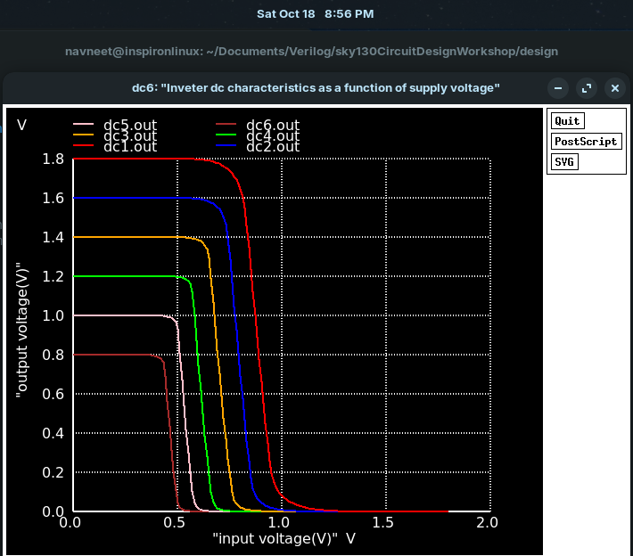
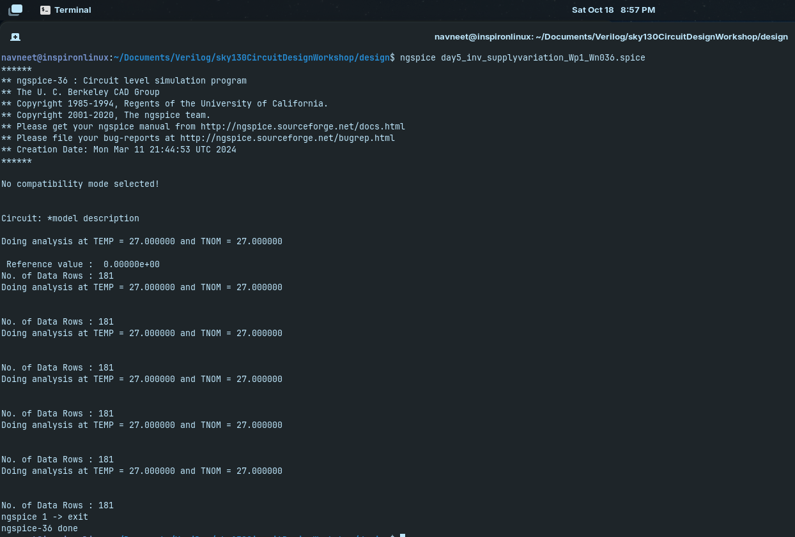
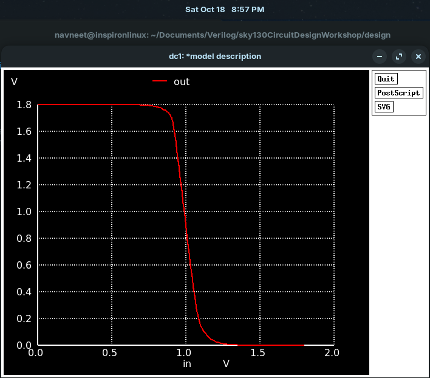
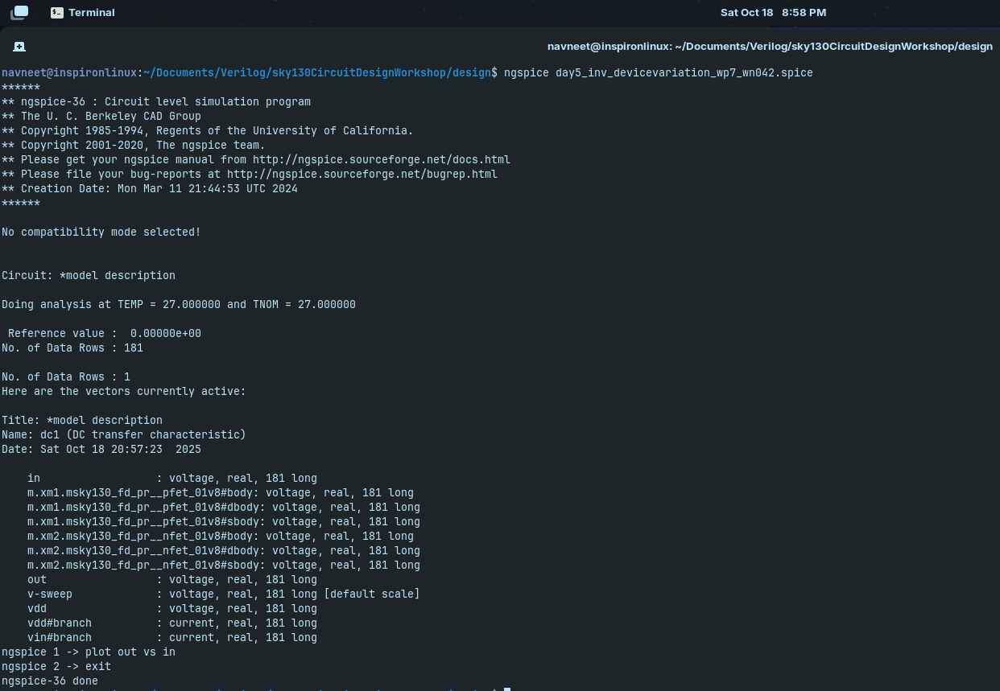

# Day 5: Power-Supply and Device Variation Studies

Vary supply voltage ( Vdd ) and re-plot VTCs to observe how switching threshold shifts, Modify transistor sizing (e.g. W/L of PMOS or NMOS) to simulate device variation, and observe effects on VTC, noise margins, delays.

---

## Table of Contents

1. [Why is it Important?](#why-is-it-important)
2. [Simulation of `day5_inv_supplyvariation_Wp1_Wn036.spice`](#simulation-of-day5_inv_supplyvariation_wp1_wn036spice-netlist)
3. [Simulation Results](#simulation-results)
4. [Simulation of `day5_inv_devicevariation_wp7_wn042.spice`](#simulation-of-day5_inv_devicevariation_wp7_wn042spice-netlist)
5. [Simulation Results](#simulation-results-1)
6. [Observations](#observations)
7. [Conclusion](#conclusion)

---

## Why is it Important?

- **Ensures Reliable Operation Across Conditions:** Digital circuits may face variations in supply voltage (V_DD) or transistor parameters (threshold voltage, mobility, etc.) due to process, temperature, or aging. Studying these variations ensures the circuit works correctly in all scenarios.  

- **Predicts Performance Changes:** Variations can affect **switching threshold (V_M), noise margins, propagation delays, and power consumption**. Understanding these effects helps designers anticipate performance shifts.  

- **Improves Robustness:** By simulating worst-case scenarios, designers can **guarantee correct logic levels** and prevent failures caused by marginal conditions.  

- **Supports Yield Optimization:** Device variations across a wafer can lead to some chips failing specifications. Variation studies help **maximize yield** by designing circuits tolerant to these differences.  

- **Guides Design Margins:** Enables designers to **set safe operating margins** for voltage, timing, and current to ensure reliable functionality even under stress.  

- **Essential for High-Speed and Low-Power Circuits:** Small variations can significantly impact **timing and noise immunity**, making such studies critical in modern VLSI design.

---


## Simulation of `day5_inv_supplyvariation_Wp1_Wn036.spice` Netlist

Simulate the netlist by,

```bash
ngspice day5_inv_supplyvariation_Wp1_Wn036.spice
```

Where the file to be simulated is,

<pre>
*Model Description
.param temp=27


*Including sky130 library files
.lib "sky130_fd_pr/models/sky130.lib.spice" tt


*Netlist Description


XM1 out in vdd vdd sky130_fd_pr__pfet_01v8 w=1 l=0.15
XM2 out in 0 0 sky130_fd_pr__nfet_01v8 w=0.36 l=0.15


Cload out 0 50fF

Vdd vdd 0 1.8V
Vin in 0 1.8V

.control

let powersupply = 1.8
alter Vdd = powersupply
	let voltagesupplyvariation = 0
	dowhile voltagesupplyvariation < 6
	dc Vin 0 1.8 0.01
	let powersupply = powersupply - 0.2
	alter Vdd = powersupply
	let voltagesupplyvariation = voltagesupplyvariation + 1
      end
 
plot dc1.out vs in dc2.out vs in dc3.out vs in dc4.out vs in dc5.out vs in dc6.out vs in xlabel "input voltage(V)" ylabel "output voltage(V)" title "Inveter dc characteristics as a function of supply voltage"

.endc

.end
</pre>

## Simulation Results



---



---

## Simulation of `day5_inv_devicevariation_wp7_wn042.spice` Netlist

Simulate the netlist by,

```bash
ngspice day5_inv_devicevariation_wp7_wn042.spice
plot out vs in
```

Where the file to be simulated is,

<pre>
*Model Description
.param temp=27


*Including sky130 library files
.lib "sky130_fd_pr/models/sky130.lib.spice" tt


*Netlist Description


XM1 out in vdd vdd sky130_fd_pr__pfet_01v8 w=7 l=0.15
XM2 out in 0 0 sky130_fd_pr__nfet_01v8 w=0.42 l=0.15


Cload out 0 50fF

Vdd vdd 0 1.8V
Vin in 0 1.8V

*simulation commands

.op

.dc Vin 0 1.8 0.01

.control
run
setplot dc1
display
.endc

.end
</pre>

## Simulation Results



---



---

## Observations

1. **Effect of Supply Voltage (V_DD) Variation:**
   - Increasing V_DD **raises both V_OH and V_OL proportionally**, shifting the VTC vertically.  
   - The **switching threshold (V_M)** moves roughly proportionally with V_DD, maintaining the approximate 50% ratio if transistors are symmetric.  
   - Noise margins (NML, NMH) **increase with higher V_DD** and decrease with lower V_DD, affecting noise tolerance.  
   - Propagation delays decrease at higher V_DD due to **higher drive currents**, and increase at lower V_DD.  

2. **Effect of Transistor Sizing (Device Variation):**
   - **Increasing PMOS width (W_P):**
     - Strengthens pull-up, making the rising transition faster.  
     - V_M shifts **lower**, as output can charge faster, slightly increasing NML and decreasing NMH.  
   - **Increasing NMOS width (W_N):**
     - Strengthens pull-down, making the falling transition faster.  
     - V_M shifts **higher**, slightly increasing NMH and decreasing NML.  
   - Asymmetric sizing impacts **noise margins**, causing one margin to dominate, potentially reducing robustness.  

---

## Conclusion

- CMOS inverter performance is **strongly influenced by supply voltage and transistor sizing**.  
- Higher V_DD improves noise margins and reduces propagation delays, while lower V_DD degrades both.  
- Transistor sizing adjustments (W/L ratios) allow designers to **tune switching threshold, speed, and noise immunity**.  
- Asymmetric sizing or extreme supply variations can **shift VTC and reduce robustness**, highlighting the need for careful design.  
- Variation studies are essential for ensuring **reliable, high-performance digital circuits** across process, voltage, and temperature (PVT) corners.  
- Overall, these studies enable **robust inverter design**, balancing speed, power, and noise tolerance for real-world operation.

---